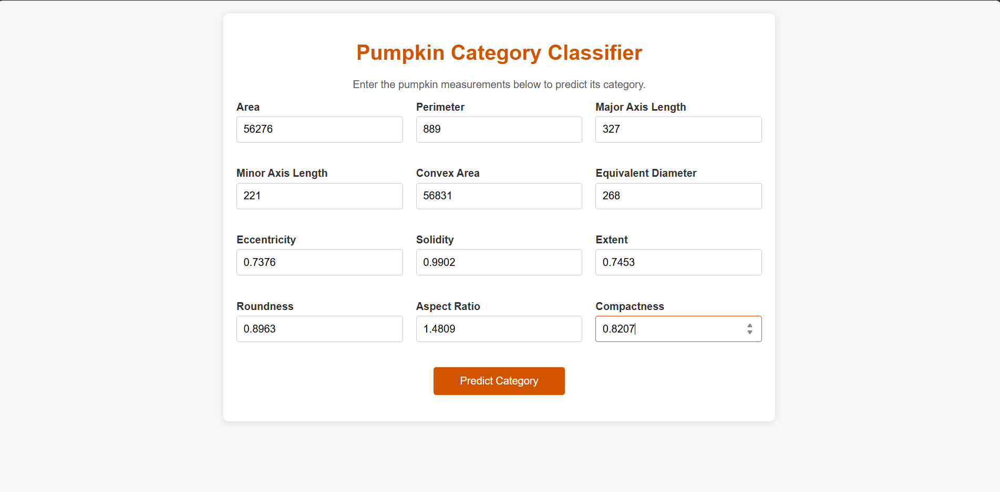
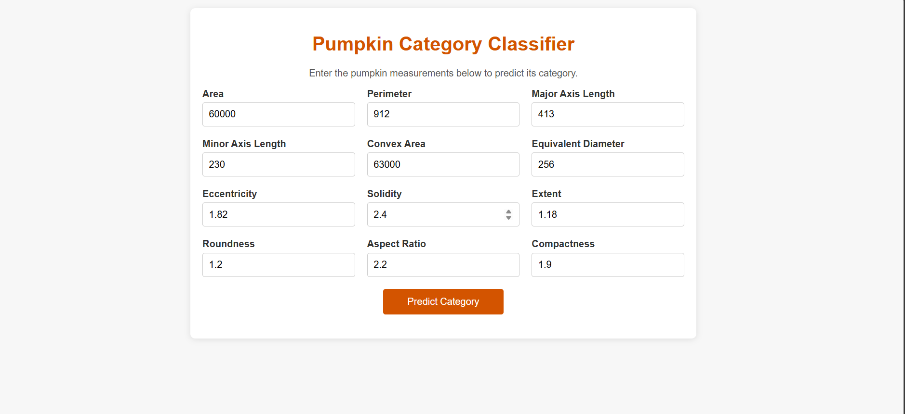
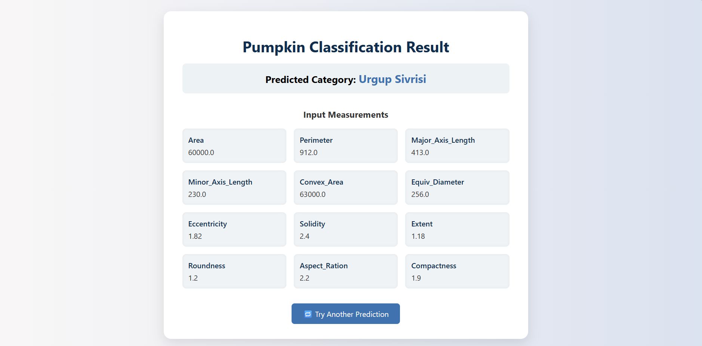

# Harvesting Brilliance: A Taxonomic Tale of Pumpkin Seed Varieties

This project helps in automated seed classification and supports agricultural research using intelligent prediction systems.

---

## How to Run

1. Install requirements:
   pip install -r requirements.txt

2. Run project:
   python app.py

## Project Screenshots

### Home Page

### Prediction Page

### Result Page

## 👨‍💻 Developed By

Atharv Patil